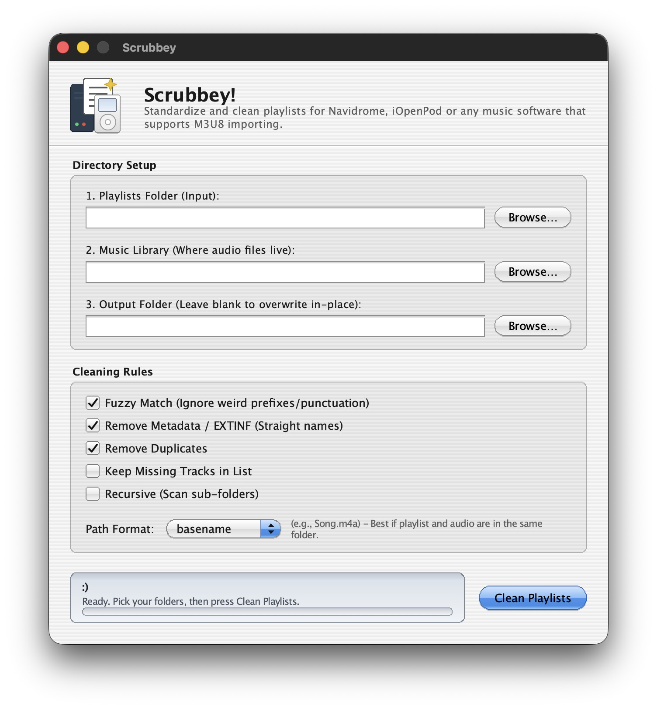

# Meet Scrubbey! 📄✨

**An M3U8/playlist cleaner for your Navidrome server, or any music software that supports M3U8 importing!**




## Features

- **Matches playlists to your real library**: entries are checked against the audio files in your music library folder.
- **Fuzzy matching**: ignores weird prefixes and punctuation so near-misses still match.
- **Strip metadata**: removes `#EXTINF` lines and leaves straight file names.
- **Remove duplicates** from each playlist.
- **Missing tracks**: drop them (default) or keep them in the list.
- **Recursive scan** of sub-folders.
- **Path format**: write `basename`, `relative` or `absolute` paths, whichever your player prefers.
- **Output folder or in place**: write cleaned copies somewhere new, or leave the field blank to overwrite.
- **Stays responsive**: the cleaner runs on a background thread, so the window never freezes on a big library.
- **No image assets**: every control is drawn on a Tkinter Canvas, gradients included.

## Install (macOS)

1. Download the latest `Scrubbey.dmg` from the [Releases](../../releases) page.
2. Open the DMG and drag **Scrubbey** into **Applications**.
3. First launch: the app is not notarized by Apple, and I'm broke so... Try to open the app once, then go to **System Settings → Privacy & Security**, scroll to **Security** and click **Open Anyway**.

You can also do `xattr -dr com.apple.quarantine "/Applications/Scrubbey.app"`


## How to use

1. **Playlists Folder (Input)**: the folder with your `.m3u8` files.
2. **Music Library**: the folder where your audio files live.
3. **Output Folder**: where the cleaned playlists go. Leave it blank to overwrite in place.
4. Choose your **Cleaning Rules** and a **Path Format**, then press **Clean Playlists** (or hit Return).

| Setting | What it does | Default |
| --- | --- | --- |
| Fuzzy Match | Ignores weird prefixes and punctuation when matching | On |
| Remove Metadata / EXTINF | Writes straight file names, no `#EXTINF` lines | On |
| Remove Duplicates | Drops repeated entries | On |
| Keep Missing Tracks in List | Keeps entries that can't be found in the library | Off |
| Recursive | Also scans sub-folders | Off |
| Path Format | `basename`, `relative` or `absolute` | `basename` |

## Run from source

You need **Python 3.9+ with Tk 8.6**. The installers from [python.org](https://www.python.org/downloads/) include it. Check yours with:

```bash
python3 -c "import tkinter; print(tkinter.TkVersion)"   # should print 8.6 or higher
```

Then:

```bash
git clone https://github.com/kerthmfy/Scrubbey.git
cd Scrubbey
python3 gui_cleaner.py
```


## Issues and pull requests

... are kinda welcome but it really is my first time releasing an app so don't expect that much from me, still learning everything.

## Meh

It's a personal project that I have vibe-coded because I want my Navidrome server and my iPod because i am importing M3U8 files at [iOpenPod](https://github.com/USERNAME/iOpenPod) which really how the idea came into fruition and it also follows the structure of my spotify playlist. Really happy how it turned out and wants to share it with y'all and maybe shares the same problem as mine lmao.

## License

Released under the [GPL-2.0](https://opensource.org/licenses/GPL-2.0).
